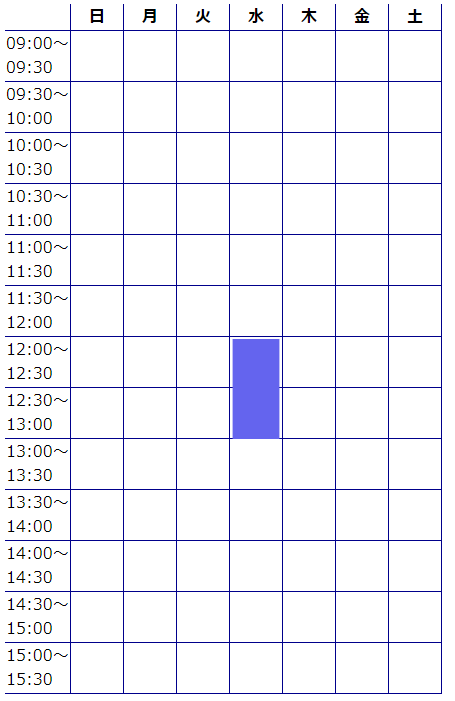

# TimeScheduleTable

シフト表などに利用できる、時間区分とスケジュール入力機能が備わったテーブルを生成します。

## Installation
/dist/からTimeScheduleTable.jsをもってきて

```html
<script src="TimeScheduleTable.js"></script>
```

## Usage

```html
<body>
    <table id="schedule"></table>
    <script src="dist/TimeScheduleTable.js"></script>
    <script>
        const timeTable = new TimeScheduleTable({
            element: '#schedule',
        });
        timeTable.set({
            begin:'12:00',
            range:'01:00'
        });
    </script>
```
CSSは適当に書いてね




## License
[MIT](https://choosealicense.com/licenses/mit/)